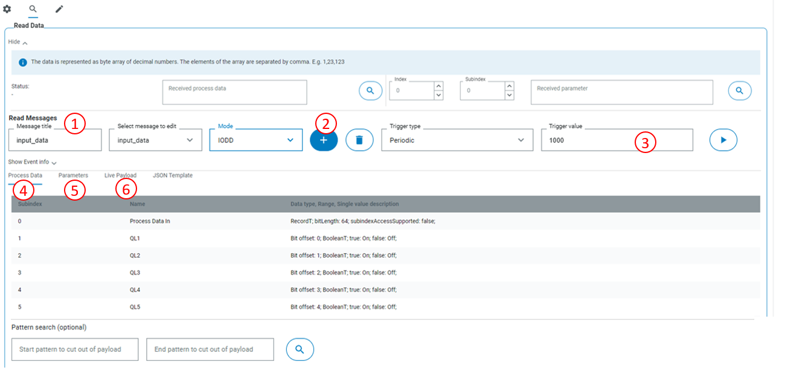
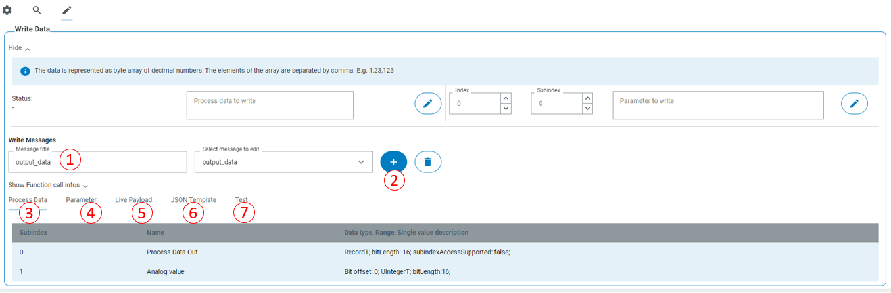

# CSK_Module_MultiIOLinkSMI
This CSK module provides an easy access to IOLink functionality of AppSpace controller.

For further information check out the [documentation](https://raw.githack.com/SICKAppSpaceCodingStarterKit/CSK_Module_MultiIOLinkSMI/main/docu/CSK_Module_MultiIOLinkSMI.html) in the folder "docu".

## How to Run
Before setting up communication with IO-Link sensor, the sensor port must be powered using [CSK_Module_PowerManager](https://github.com/SICKAppSpaceCodingStarterKit/CSK_Module_PowerManager).
The app includes an intuitive GUI to setup communication with IOLink device.

### Communuication setup

1. After powering the used port, select it in UI
2. Activate the port
3. If there is an IO-Link device connected to activated port, you will see all available information about its identification
4. You can send and receive values to/from device as decimal byte arrays for testing purposes (no IODD needed)

If there is available [IODD interpreter](https://github.com/SICKAppSpaceCodingStarterKit/CSK_Module_IODDInterpreter) with loaded IODD file for the connected device, it is possible to create customized IODD read and write messages:

### Read data

1. Create a new Read Message
2. Rename it if necessary
3. Select when you want to read data, periodically (period in ms) or on some CROWN event
4. select process data you want to read from device
5. select parameters you want to read from device
6. See result of reading the message. You can refresh the latest received payload or initiate reading from UI.

### Write data

1. Create a new Write Message
2. Rename it if necessary
3. select process data you want to write to device
4. select parameters you want to write to device
5. See the latest message written to the device
6. Get the JSON template that can must be used for message to be written
7. Test writing message to the device by coping and editing the JSON template

## Dependencies

Following CSK modules are mostly necessary to make use of the features of this module:
|Module|Version|Remark
|--|--|--|
|CSK_Module_PowerManager|[V2.5.0](https://github.com/SICKAppSpaceCodingStarterKit/CSK_Module_PowerManager/releases/tag/v2.5.0)|To power ports|
|CSK_Module_IODDInterpreter|[V1.0.0](https://github.com/SICKAppSpaceCodingStarterKit/CSK_Module_IODDInterpreter)|To set read and write messages|
|CSK_1stModule_Logger|[V4.0.0](https://github.com/SICKAppSpaceCodingStarterKit/CSK_1stModule_Logger/releases/tag/v4.0.0)|To log problems with data interpretation|
|CSK_Module_PersistentData|[V4.0.0](https://github.com/SICKAppSpaceCodingStarterKit/CSK_Module_PersistentData)|To persist data|

## Information

### Tested on

|Device|Firmware|
|--|--|
|SIM1012|V2.3.0|

This application / module is part of the SICK AppSpace Coding Starter Kit developing approach.  
It is programmed in an object oriented way. Some of the modules use kind of "classes" in Lua to make it possible to reuse code / classes in other projects.  
In general it is not neccessary to code this way, but the architecture of this app can serve as a sample to be used especially for bigger projects and to make it easier to share code.  
Please check the [documentation](https://github.com/SICKAppSpaceCodingStarterKit/.github/blob/main/docu/SICKAppSpaceCodingStarterKit_Documentation.md) of CSK for further information.  

## Topics

Coding Starter Kit, CSK, Module, SICK-AppSpace, IO-Link, IODD
